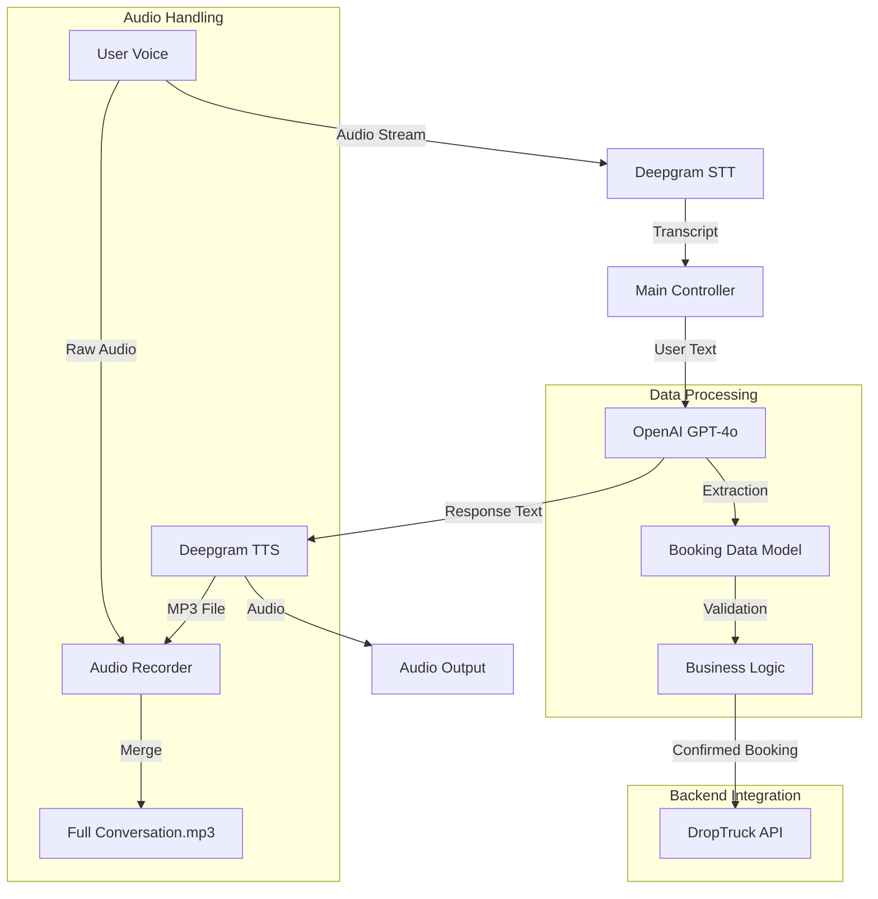

# DropTruck Voice Agent - Technical Documentation

## 1. Overview
The DropTruck Voice Agent is an AI-powered conversational system designed to handle customer enquiries, collect booking details, and integrate with the DropTruck backend API. It uses a modular architecture combining Speech-to-Text (STT), Large Language Models (LLM), and Text-to-Speech (TTS).

## 2. System Architecture



## 3. Key Components

### 3.1 Speech-to-Text (STT)
- **Provider**: Deepgram (Nova-2 model)
- **Features**:
  - **Endpointing**: 900ms delay to allow natural pauses.
  - **Keyword Boosting**: Optimized for Indian cities (Chennai, Bangalore, etc.) and truck types.
  - **Noise Filtering**: Custom logic to ignore partial words and duplicates.
  - **Interim Results**: Real-time processing with duplicate removal.

### 3.2 LLM & Intelligence (`app/llm.py`)
- **Provider**: OpenAI (GPT-4o)
- **Persona**: DropTruck Sales Agent (Professional, concise, voice-friendly).
- **Data Extraction**:
  - **Locations**: Extracts Pickup/Drop cities, handles "In Chennai" -> "Chennai".
  - **Vehicle Types**: Fuzzy matching (85% threshold) for 50+ truck types (Tata Ace, Bolero, etc.).
  - **Dates**: Converts relative dates ("tomorrow") to `YYYY-MM-DD`.
  - **Confirmation**: Extracts details from AI's own confirmation message to ensure accuracy.
- **Auto-Shutdown**: Detects "Thank you", "Goodbye", or `BOOKING_CONFIRMED` marker.

### 3.3 Text-to-Speech (TTS)
- **Provider**: Deepgram (Aura model)
- **Output**: Generates MP3 files for each response.
- **Playback**: Low-latency streaming playback.

### 3.4 Audio Recorder & Merging
- **Recording**: Captures user audio (microphone) and AI audio (TTS files).
- **Merging**: Uses `ffmpeg` to merge user and AI audio into a single chronological MP3 file (`full_conversation.mp3`).
- **Session Management**: Creates unique folders for each call session.

### 3.5 API Integration (`core/api_client.py`)
- **Endpoint**: `http://127.0.0.1:8000/agent-newindent`
- **Payload**: Sends Name, Contact, Pickup, Drop, Truck, Body, Material, Date.
- **Status Handling**: Accepts HTTP 200 and 201 as success.

## 4. Recent Technical Improvements

### ✅ Data Extraction Robustness
- **Fuzzy Matching**: Implemented `fuzzywuzzy` to handle accents and typos (e.g., "Tata AC" -> "Tata Ace").
- **Confirmation Parsing**: If user input is unclear, the system extracts data from the *AI's confirmation message*, which acts as a verified source of truth.
- **Prefix Cleaning**: Automatically removes "In", "From", "At" from location names.

### ✅ Conversation Flow
- **Auto-Greeting**: AI initiates conversation immediately upon connection.
- **No Duplicates**: Greeting is injected into history to prevent repetition.
- **Smart Interruptions**: STT ignores short noise (<3 chars) to prevent accidental interruptions.

### ✅ Infrastructure
- **Logging**: Comprehensive JSON and text logs in `storage/logs/`.
- **Error Handling**: Graceful shutdown on API errors or network issues.
- **Environment**: Secure API key management via `.env`.

## 5. File Structure
```
Voice_Agent/
├── app/
│   ├── llm.py          # Intelligence & Extraction logic
│   ├── stt.py          # Speech recognition setup
│   └── tts.py          # Speech synthesis setup
├── core/
│   ├── api_client.py   # DropTruck API integration
│   ├── audio_recorder.py # Audio merging logic
│   ├── logger.py       # System logging
│   └── prompt.py       # System prompts & data models
├── storage/
│   ├── audio_output/   # Session audio files
│   └── logs/           # Session logs
├── main.py             # Entry point & orchestration
└── requirements.txt    # Dependencies
```

## 6. Future Recommendations
- **Deployment**: Dockerize the application for server deployment.
- **Telephony**: Integrate with Twilio/Exotel for PSTN (phone) calls.
- **Dashboard**: Build a UI to view logs and listen to recordings.
